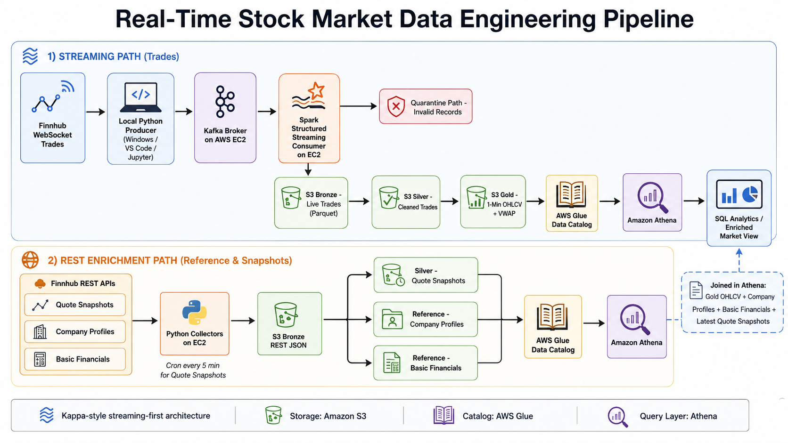
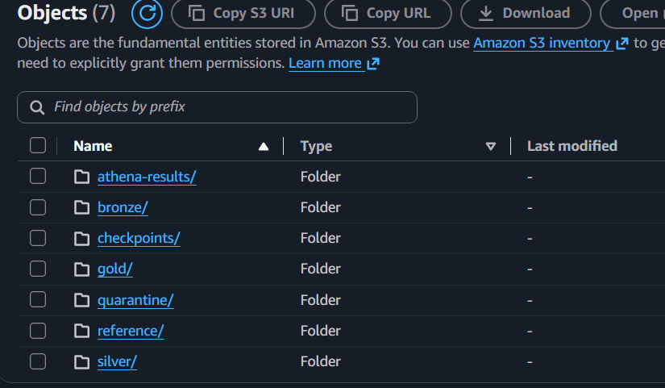
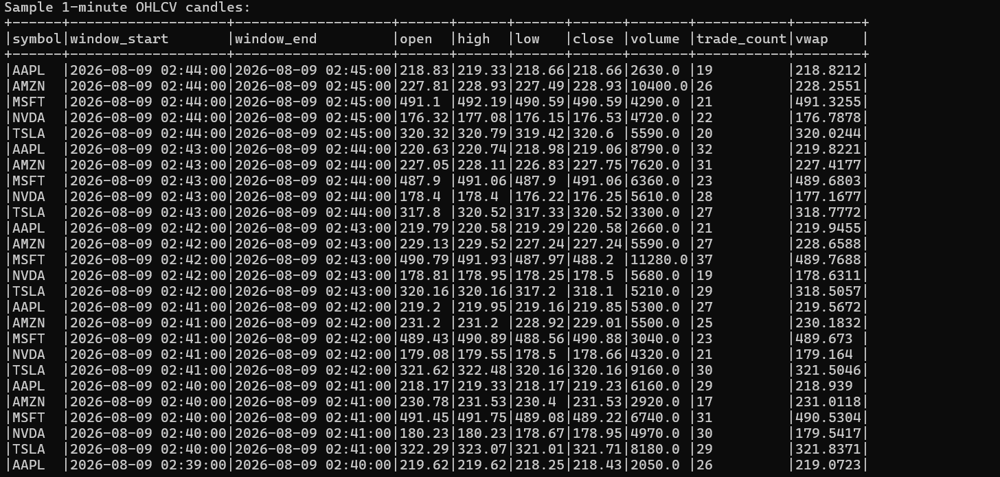
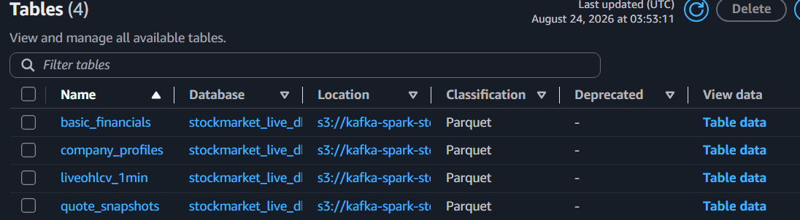
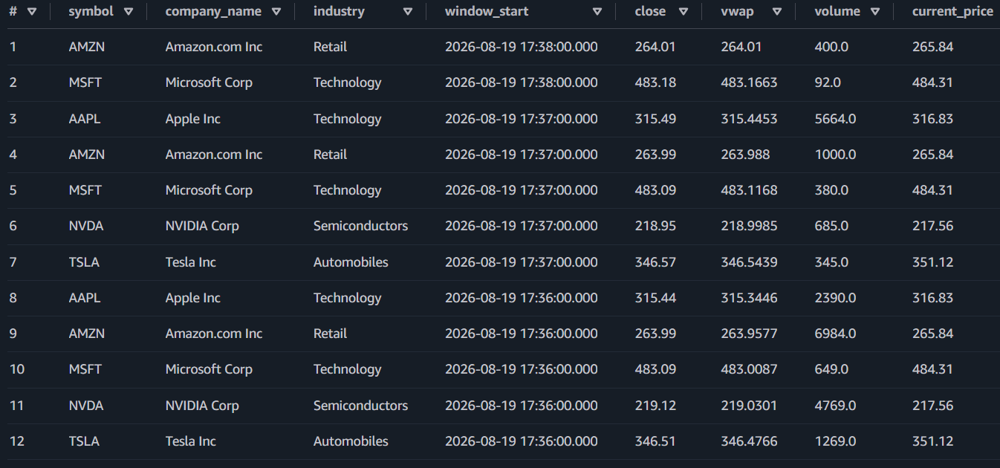

# Real-Time Stock Market Data Engineering Pipeline

A streaming-first data engineering project that ingests live U.S. equity trades from Finnhub, processes them through Apache Kafka and Apache Spark, stores curated datasets in Amazon S3, catalogs them with AWS Glue, and serves analytics through Amazon Athena.

The project also includes a REST enrichment path for quote snapshots, company profiles, and basic financial metrics, allowing live market data to be joined with reference and fundamental information.

> **Tracked symbols:** AAPL, MSFT, NVDA, TSLA, AMZN

---

## Architecture

<!-- IMAGE PLACEHOLDER: Save your final Excalidraw export as Images/architecture_diagram.png -->



The solution is split into two complementary ingestion paths.

### Streaming path — live trades

```text
Finnhub WebSocket
        ↓
Local Python Producer
        ↓
Apache Kafka on AWS EC2
        ↓
Apache Spark Structured Streaming on AWS EC2
        ↓
Validation
   ┌────┴────┐
   ↓         ↓
Bronze   Quarantine
   ↓
Silver
   ↓
Gold — 1-Min OHLCV + VWAP
   ↓
AWS Glue Data Catalog
   ↓
Amazon Athena
```

### REST enrichment path

```text
Finnhub REST APIs
   ├── Quote Snapshots
   ├── Company Profiles
   └── Basic Financials
          ↓
   Python Collectors on EC2
          ↓
      S3 Bronze JSON
       ┌──┴───────────────┐
       ↓                  ↓
Silver Quote        Reference Tables
Snapshots           ├── Company Profiles
                    └── Basic Financials
       └──────────────┬───────┘
                      ↓
               AWS Glue Catalog
                      ↓
                 Amazon Athena
```

The streaming and REST datasets are joined in Athena to create an enriched market analytics view.

---

## Tech Stack

| Layer | Technologies |
|---|---|
| Data Source | Finnhub WebSocket API, Finnhub REST API |
| Programming | Python, SQL |
| Streaming | Apache Kafka |
| Stream Processing | Apache Spark Structured Streaming |
| Compute | AWS EC2 |
| Data Lake | Amazon S3 |
| Storage Format | Parquet, JSON |
| Catalog | AWS Glue Data Catalog |
| Query Engine | Amazon Athena |
| Scheduling | Linux Cron |
| Security | AWS IAM, EC2 Security Groups, environment variables |
| Development | VS Code, Jupyter, Git/GitHub |

---

## Key Features

- Real-time ingestion of U.S. stock trades using the Finnhub WebSocket API.
- Kafka-based event streaming with separate internal and external listeners.
- Spark Structured Streaming consumer running on a separate EC2 instance.
- Explicit trade schema parsing and validation before downstream processing.
- Quarantine path for malformed or invalid trade records.
- S3 Bronze, Silver, and Gold data layers using Parquet.
- Spark checkpointing for restart and Kafka offset recovery.
- 1-minute OHLCV aggregation with trade count and VWAP.
- REST ingestion for quote snapshots, company profiles, and basic financial metrics.
- Quote snapshots scheduled every five minutes during U.S. market hours while the collector EC2 instance is running.
- AWS Glue crawlers for schema discovery and catalog registration.
- Athena SQL joins across market, company, quote, and fundamental datasets.
- Separate simulated and live paths for off-market development and production validation.

---

# Streaming Pipeline

## 1. Finnhub WebSocket Producer

The local Python producer connects to the Finnhub WebSocket API and subscribes to:

```text
AAPL
MSFT
NVDA
TSLA
AMZN
```

Each incoming trade is normalized before being published to Kafka.

Example normalized event:

```json
{
  "schema_version": "1.0",
  "event_id": "uuid",
  "event_type": "trade",
  "source": "finnhub",
  "symbol": "AAPL",
  "price": 314.95,
  "volume": 100.0,
  "trade_conditions": [],
  "event_timestamp_ms": 1787160000000,
  "event_timestamp_utc": "2026-08-19T17:20:00+00:00",
  "ingestion_timestamp_utc": "2026-08-19T17:20:00+00:00"
}
```

Kafka message keys use the stock symbol so events for the same symbol preserve partition ordering.

> A dedicated producer-to-consumer screenshot was not captured. Live execution is instead demonstrated through the downstream S3, Gold, Glue, and Athena outputs shown below.

---

## 2. Kafka on AWS EC2

Kafka runs on a dedicated EC2 instance with ZooKeeper.

Two listeners are configured:

```text
INTERNAL → private-ip:9092
EXTERNAL → public-ip:9093
```

- The local Windows producer connects through the external listener.
- Spark connects through the internal listener over the AWS private network.
- EC2 security groups restrict access rather than exposing Kafka publicly.

Kafka topics:

```text
stock-trades-raw
stock-trades-test
```

The test topic is used for simulated data while markets are closed.

### Kafka Persistence

Kafka and ZooKeeper were initially configured under `/tmp`, which caused topic metadata and backlog loss after an EC2 stop/start.

Persistent paths were moved to:

```text
ZooKeeper: /var/lib/zookeeper
Kafka:     /var/lib/kafka/data
```

This ensures topic state survives instance restarts.

---

## 3. Spark Structured Streaming

A separate EC2 instance runs Apache Spark Structured Streaming.

Spark consumes Kafka messages using:

```text
Kafka → Spark → Schema Parsing → Validation → S3
```

The trade schema includes:

```text
event_id
symbol
price
volume
trade_conditions
event_timestamp
ingestion_timestamp
Kafka topic / partition / offset
```

Validation checks include:

```text
missing_event_id
missing_symbol
unsupported_symbol
key_symbol_mismatch
invalid_price
invalid_volume
invalid_event_timestamp
invalid_ingestion_timestamp
```

Valid records continue to Bronze, while invalid records are routed to Quarantine.

---

# Data Lake Layers

## Bronze

Bronze preserves traceable trade-level data and Kafka metadata.

Live path:

```text
s3://kafka-spark-stock-project-kris/stock-market/bronze/live/trades/
```

Simulated path:

```text
s3://kafka-spark-stock-project-kris/stock-market/bronze/simulated/trades/
```

Bronze trades are partitioned by ingestion time:

```text
year/
month/
day/
hour/
```

The original Kafka JSON payload is retained for lineage and troubleshooting.

<!-- IMAGE PLACEHOLDER -->


---

## Quarantine

Invalid Kafka records are not silently discarded.

They are written to:

```text
stock-market/quarantine/live/trades/
stock-market/quarantine/simulated/trades/
```

Examples tested:

```text
Missing event_id
Unsupported symbol
Negative price
Kafka key / symbol mismatch
```

Each quarantined record retains the raw message and a `validation_error` value for investigation or reprocessing.

---

## Silver

Silver converts Bronze trades into cleaner analytics-ready records.

Transformations include:

- symbol standardization
- typed timestamps
- duplicate removal using `event_id`
- retention of useful Kafka lineage fields
- analytics date/time fields

Live path:

```text
stock-market/silver/live/trades/
```

Simulated path:

```text
stock-market/silver/simulated/trades/
```

Spark shuffle partitions were reduced for the project workload after testing exposed an excessive small-files problem.

---

## Gold

The Gold layer aggregates individual trades into **1-minute candles per symbol**.

Metrics:

```text
Open
High
Low
Close
Volume
Trade Count
VWAP
```

VWAP:

```text
Σ(price × volume)
─────────────────
    Σ(volume)
```

Live path:

```text
stock-market/gold/live/ohlcv_1min/
```

Simulated path:

```text
stock-market/gold/simulated/ohlcv_1min/
```

<!-- IMAGE PLACEHOLDER -->


---

# Checkpointing and Recovery

Spark Structured Streaming checkpoints are stored in S3.

Example:

```text
stock-market/checkpoints/bronze_live_trades/
```

A recovery test was performed by processing an event, stopping Spark, publishing another Kafka event, and restarting Spark with the same checkpoint. Spark resumed from the saved Kafka offset and processed only the new event.

---

# Simulated Market Stream

Because U.S. markets are not always open during development, a synthetic producer was created using the same normalized trade schema.

The simulator:

- generates trades for the same five symbols,
- uses gradual random price movement,
- emits realistic trade volumes,
- publishes continuously to `stock-trades-test`,
- allows Bronze, Silver, and Gold development outside market hours.

Simulated and live data are isolated using separate Kafka topics, S3 paths, and checkpoints.

---

# REST Enrichment Pipeline

## Quote Snapshots

Collected fields include:

```text
symbol
current_price
change
percent_change
day_open
day_high
day_low
previous_close
quote_timestamp
collection_timestamp
```

Bronze:

```text
stock-market/bronze/rest/quote_snapshots/
```

Silver:

```text
stock-market/silver/rest/quote_snapshots/
```

The Bronze payload preserves the original Finnhub response while Silver converts snapshots into typed Parquet rows.

### Automation

A Linux cron job runs the quote collector every five minutes during regular U.S. market hours:

```text
09:30 ET → 16:00 ET
Monday → Friday
```

The EC2 instance must be running for cron executions to occur.

---

## Company Profiles

Company Profile 2 data is collected for each symbol.

Useful fields include:

```text
symbol
company_name
industry
exchange
country
currency
IPO date
market capitalization
shares outstanding
website
```

Reference path:

```text
stock-market/reference/company_profiles/
```

This dataset acts as a lightweight company dimension.

---

## Basic Financials

Finnhub returned over 100 financial metrics per company.

The downstream reference layer extracts a focused subset:

```text
P/E TTM
EPS TTM
EPS Growth TTM YoY
Revenue Growth TTM YoY
Gross Margin TTM
Net Profit Margin TTM
ROE TTM
Current Ratio
Debt-to-Equity
Beta
52-Week High
52-Week Low
```

Reference path:

```text
stock-market/reference/basic_financials/
```

---

# AWS Glue Data Catalog

Glue crawlers register the analytical datasets and make their schemas available to Athena.

The live database includes:

```text
live_ohlcv_1min
quote_snapshots
company_profiles
basic_financials
```

<!-- IMAGE PLACEHOLDER -->


---

# Amazon Athena Analytics

Athena provides the SQL serving layer over cataloged S3 datasets.

The project joins:

```text
Gold 1-minute OHLCV
        +
Latest Quote Snapshot
        +
Company Profile
        +
Basic Financials
```

to create an enriched market view.

Example fields:

```text
symbol
company_name
industry
window_start
open
high
low
close
volume
trade_count
vwap
current_price
percent_change
pe_ttm
eps_ttm
revenue_growth_ttm_yoy
net_profit_margin_ttm
roe_ttm
beta
```

<!-- IMAGE PLACEHOLDER: use a narrow Athena query screenshot -->


For a readable README screenshot:

```sql
SELECT
    symbol,
    company_name,
    industry,
    window_start,
    close,
    vwap,
    volume,
    current_price,
    percent_change,
    pe_ttm,
    revenue_growth_ttm_yoy,
    beta
FROM stockmarket_live_db.enriched_market_data
ORDER BY window_start DESC, symbol
LIMIT 20;
```

A small CSV export is stored at:

```text
enriched_ohlcv_financials.csv
latest_quote_enrichment.csv
```

---

# Example Athena Join

```sql
WITH latest_quotes AS (
    SELECT *
    FROM (
        SELECT
            q.*,
            ROW_NUMBER() OVER (
                PARTITION BY symbol
                ORDER BY collected_at DESC
            ) AS rn
        FROM stockmarket_live_db.quote_snapshots q
    )
    WHERE rn = 1
)

SELECT
    g.symbol,
    p.company_name,
    p.industry,
    g.window_start,
    g.close,
    g.vwap,
    g.volume,
    q.current_price,
    q.percent_change,
    f.pe_ttm,
    f.eps_ttm,
    f.revenue_growth_ttm_yoy,
    f.net_profit_margin_ttm,
    f.roe_ttm,
    f.beta
FROM stockmarket_live_db.liveohlcv_1min g
LEFT JOIN stockmarket_live_db.company_profiles p
    ON g.symbol = p.symbol
LEFT JOIN stockmarket_live_db.basic_financials f
    ON g.symbol = f.symbol
LEFT JOIN latest_quotes q
    ON g.symbol = q.symbol
ORDER BY g.window_start DESC, g.symbol;
```

---

# Repository Structure

```text
KAFKA-STOCK-MARKET-PROJECT/
│
├── consumer_scripts_spark/
│   ├── kafka_bronze_raw.ipynb
│   ├── kafka_gold_writer.ipynb
│   ├── kafka_parsed_consumer.ipynb
│   ├── kafka_quarantine_test.ipynb
│   ├── kafka_raw_consumer.ipynb
│   ├── kafka_silver_writer.ipynb
│   └── kafka_validated_consumer.ipynb
│
├── producer/
│   ├── finnhub_quote_collector.ipynb
│   ├── finnhub-producer.ipynb
│   └── kafkaproducer-test.ipynb
│
├── REST_datasets/
│   ├── finnhub_basic_financials_collector.ipynb
│   ├── finnhub_company_profile.ipynb
│   ├── inspect_basic_financials.ipynb
│   ├── rest_company_profile_writer.ipynb
│   ├── rest_quotes_silver_preview.ipynb
│   └── rest_quotes_silver_writer.ipynb
│
├── SQL_queries/
│   ├── enriched_ohlcv_financials.sql
│   ├── latest_quote_enrichment.sql
│   └── create_enriched_market_view.sql
│
├── Images/
│   ├── architecture_diagram.png
│   ├── s3_data_lake_structure.png
│   ├── gold_ohlcv_output.png
│   ├── glue_catalog_tables.png
│   └── athena_enriched_query.png
│
├── .env.example
├── .gitignore
├── kafka_commands.txt
├── spark_commands.txt
├── requirements.txt
├── requirements-lock.txt
└── README.md
```

---

# S3 Layout

```text
stock-market/
│
├── bronze/
│   ├── live/trades/
│   ├── simulated/trades/
│   └── rest/
│       ├── quote_snapshots/
│       ├── company_profiles/
│       └── basic_financials/
│
├── silver/
│   ├── live/trades/
│   ├── simulated/trades/
│   └── rest/quote_snapshots/
│
├── gold/
│   ├── live/ohlcv_1min/
│   └── simulated/ohlcv_1min/
│
├── quarantine/
│   ├── live/
│   └── simulated/
│
├── reference/
│   ├── company_profiles/
│   └── basic_financials/
│
├── checkpoints/
│
└── athena-results/
```

---

# Configuration

Example `.env.example`:

```env
FINNHUB_API_KEY=your_finnhub_api_key
KAFKA_BOOTSTRAP_SERVERS=your_kafka_public_ip:9093
KAFKA_TEST_TOPIC=stock-trades-test
KAFKA_RAW_TRADES_TOPIC=stock-trades-raw
```

---

# Reliability and Engineering Decisions

### Separate Kafka listeners

Internal and external listeners allow the local producer to use the public endpoint while Spark consumes over AWS private networking.

### Persistent Kafka storage

Kafka and ZooKeeper state was moved from `/tmp` to `/var/lib` after testing exposed topic loss following instance restarts.

### Spark checkpoints

S3 checkpoints allow Structured Streaming queries to resume from previously committed Kafka offsets.

### Quarantine instead of silent drops

Invalid events are preserved for investigation rather than being discarded.

### Simulated vs live isolation

Synthetic test data uses separate Kafka topics, S3 paths, and checkpoints to avoid contaminating real datasets.

### Practical downstream processing

Streaming is used where low-latency ingestion matters most, while downstream transformations intentionally remain simpler to avoid unnecessary infrastructure complexity.

---

# Challenges Solved

### Kafka latency and EC2 sizing
Running ZooKeeper and Kafka on a very small EC2 instance caused severe latency and SSH responsiveness issues. Increasing resources and adding swap stabilized the broker.

### Kafka listener configuration
A dual-listener setup was required for local public producer access and private Spark consumption.

### Kafka state loss after EC2 restart
Using `/tmp` for Kafka and ZooKeeper storage caused topic metadata loss. Persistent `/var/lib` storage resolved the issue.

### Spark → S3 connectivity
Spark required the S3A connector and compatible Hadoop AWS dependencies to write Parquet directly to S3 using the EC2 IAM role.

### EC2 disk exhaustion
Dependency downloads and Spark runtime files filled the original root volume. The EBS volume was expanded and the partition/filesystem resized.

### Spark small-files problem
Silver initially generated excessive tiny Parquet files. Reducing Spark shuffle partitions significantly reduced output fragmentation.

### Development outside market hours
A continuous simulated trade producer allowed the full streaming pipeline to be built and tested while the U.S. market was closed.

---

# Project Outcomes

The completed pipeline demonstrates:

- real-time trade ingestion,
- Kafka-based event streaming,
- distributed Spark processing,
- schema validation and quarantine handling,
- S3 Bronze/Silver/Gold organization,
- checkpoint-based stream recovery,
- 1-minute OHLCV and VWAP aggregation,
- REST-based market and company enrichment,
- AWS Glue cataloging,
- Athena-based SQL analytics,
- and cross-dataset enriched market views.

---

# Future Enhancements

Potential extensions:

- lightweight BI dashboard on top of Athena
- additional Finnhub earnings or news datasets
- infrastructure-as-code deployment
- stronger monitoring and alerting
- scheduled downstream orchestration
- Apache Iceberg for update-heavy table semantics

These are intentionally outside the current project scope to keep the architecture complete but understandable without unnecessary over-engineering.

---

## Author

Built as a portfolio data engineering project focused on real-time ingestion, distributed processing, cloud data lake architecture, and analytics serving.
